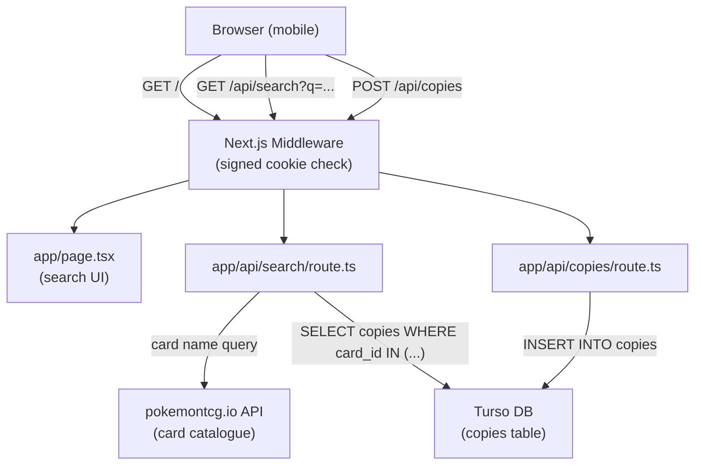
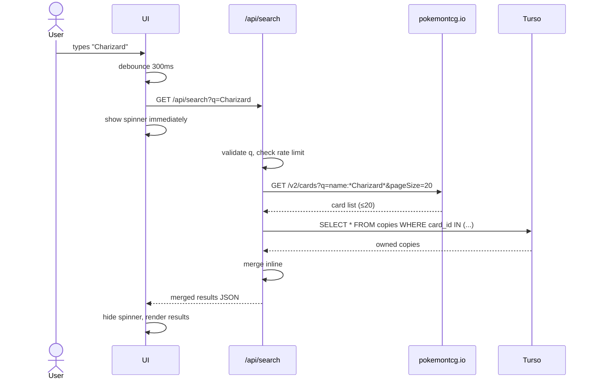
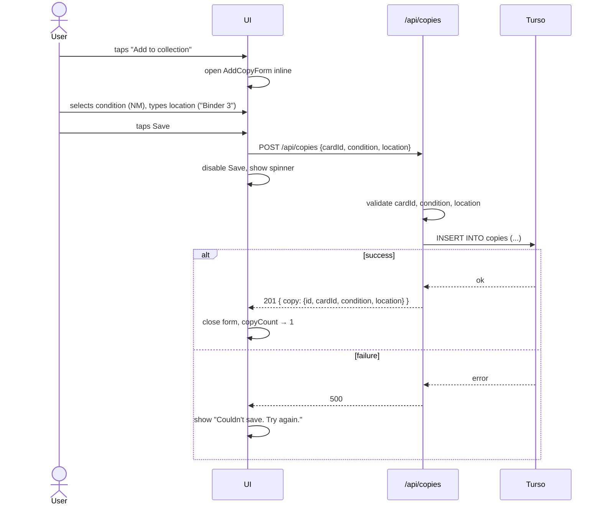

# Design: Card Search

> The technical spec. HOW the requirements are met. Reads `requirements.md` and `constitution.md` as constraints.

---
references:
  - requirements.md
  - ../../memory/constitution.md
  - ../../memory/architecture.md
  - ../../decisions/card-search/ADR-001-use-pokemontcg-io-as-card-catalogue.md
  - ../../decisions/card-search/ADR-002-proxy-pokemontcg-via-api-route.md
  - ../../decisions/card-search/ADR-003-stub-auth-with-env-passphrase.md
  - ../../decisions/card-search/ADR-004-copies-table-schema.md
---

## Overview

The search page is the root of the app. A debounced search input fires a request to a Next.js API route (`/api/search`), which queries pokemontcg.io for matching catalogue cards and Turso for owned copies, merges the two inline, and returns a single JSON response. The UI renders each catalogue match with its ownership status and copy details inline — no page navigation required. If a card shows zero owned copies, an "Add to collection" inline form lets the user record a new copy via `POST /api/copies`. All API routes are protected by a signed `HttpOnly` session cookie checked in Next.js middleware (stub auth, superseded by a future auth spec).

## Threat model

Trust boundaries: browser → Next.js middleware → API routes → (pokemontcg.io, Turso). Jonas is the sole authenticated user. The passphrase is the single credential; the session cookie is its proof of authentication. Threats in scope for this design: forged session cookies, query injection into the pokemontcg.io call, and invalid input to the copies write path. Threats explicitly out of scope for this stub-auth design: multi-user access control, account takeover via credential stuffing, and data exfiltration beyond Jonas's own collection.

## Architecture



**Folder layout additions** (slotting into `architecture.md`):

```
app/
  page.tsx                  # Search page (root route)
  login/page.tsx            # Passphrase login page
  api/
    search/route.ts         # GET — catalogue search + collection merge (inline)
    copies/route.ts         # POST — add a copy
    logout/route.ts         # POST — clear session cookie
components/
  SearchInput.tsx           # Debounced input
  CardResult.tsx            # One catalogue card + inline copy detail rows + add form
  AddCopyForm.tsx           # Inline condition + location form
lib/
  db.ts                     # Turso client (libsql), read/write token only (no DDL)
  auth.ts                   # Cookie signing/verification (HMAC-SHA256)
```

No `lib/merge.ts` — merge logic is five lines inlined in `search/route.ts`. No `lib/pokemontcg.ts` — the single `fetch` call is inlined in `search/route.ts`. No `CopyList.tsx` — copy rows are rendered inline inside `CardResult.tsx`; extract only if the component grows its own state.

## Data model

### `copies` table

```sql
CREATE TABLE copies (
  id         TEXT NOT NULL PRIMARY KEY,  -- UUID v4, generated server-side
  card_id    TEXT NOT NULL,              -- pokemontcg.io card ID, e.g. "sv3pt5-25"
  condition  TEXT NOT NULL,              -- NM | LP | MP | HP | DMG
  location   TEXT NOT NULL,             -- binder/box label, e.g. "Binder 3"
  created_at TEXT NOT NULL              -- ISO 8601, UTC
);

CREATE INDEX idx_copies_card_id ON copies (card_id);
```

**Design notes:**
- No `language` column — no requirement drives it; add via migration when a spec does.
- The card catalogue is not mirrored; only copy records are stored. See ADR-004.
- `card_id` uses pokemontcg.io's stable card ID. See ADR-001.
- `created_at` is stored for future audit use but not returned in API responses.
- **Data retention:** no limit; user-initiated deletion is out of scope for v1.
- **Turso token:** must be scoped to read/write only — no DDL permissions — to limit blast radius from a server-side bug.

### Migration strategy

First feature — no existing schema. The `copies` table is created on first deploy via a migration script run as part of the Vercel build step (`npm run db:migrate`). Migration files live in `lib/migrations/`.

## Interfaces

### `GET /api/search?q={query}`

**Request:** `q` — URL-encoded search string, 1–100 characters. Validated server-side: reject if empty/whitespace (400); validate against `^[\w\s'\-\.]+$` (printable word characters, spaces, apostrophes, hyphens, dots only); percent-encode before interpolating into the pokemontcg.io query string.

**Response (200):**
```ts
{
  results: Array<{
    card: {
      id: string          // pokemontcg.io card ID
      name: string
      set: { name: string }
      number: string      // collector number, e.g. "025/165"
    }
    copies: Array<{
      id: string
      condition: "NM" | "LP" | "MP" | "HP" | "DMG"
      location: string
    }>
    copyCount: number
  }>
}
```

Note: `results.length === 20` signals the catalogue may have more matches — the UI shows a "refine your search" prompt when this is true. No explicit `truncated` field; client derives it from `results.length`.

**Error responses:**
- `400` — missing, empty, or invalid characters in query
- `401` — missing or invalid session cookie
- `429` — rate limit exceeded (see rate limiting below)
- `502` — pokemontcg.io unreachable
- `500` — Turso read failure (distinct from 0-copy result — criterion 2.5)

**Behaviour:**
1. Validate `q`: reject if empty/whitespace (400); strip or reject invalid characters.
2. Check per-session rate limit: reject with 429 if exceeded.
3. Call pokemontcg.io: `GET /v2/cards?q=name:"*{encoded_q}*"&pageSize=20`. Cap at 20 results.
4. Extract card IDs from response.
5. Query Turso: `SELECT * FROM copies WHERE card_id IN (…)`.
6. Group copies by `card_id` inline; merge into results array.
7. Return merged JSON.

**Rate limiting:** a simple per-session in-memory counter (reset every 60 seconds) capped at 60 requests/minute. Sufficient for normal debounced use; blocks runaway retry loops. Implemented in middleware or the route handler using a Map keyed on session ID derived from the signed cookie.

### `POST /api/copies`

**Request body:**
```ts
{
  cardId:    string   // pokemontcg.io card ID — validated: /^[a-z0-9]+-[a-z0-9]+$/i, max 32 chars
  condition: "NM" | "LP" | "MP" | "HP" | "DMG"
  location:  string   // 1–100 chars, non-empty after trim
}
```

**Response (201):**
```ts
{
  copy: { id, cardId, condition, location }
}
```

Note: `createdAt` is stored in the DB but not returned — the client only needs to update its local copy count.

**Error responses:**
- `400` — missing required fields, invalid condition value, empty/invalid `cardId`, empty location
- `401` — missing or invalid session cookie
- `500` — Turso write failure (never silently discard — criterion 4.4)

### Authentication: `POST /api/logout`

Clears the session cookie. Returns 200. No body. Middleware redirects to `/login` on next request.

### Cookie signing (lib/auth.ts)

Session cookie value: `HMAC-SHA256(sessionId, AUTH_PASSPHRASE)` concatenated with the sessionId, base64url-encoded. Cookie also includes a version claim (`v=<hash of AUTH_PASSPHRASE>`). Middleware rejects cookies whose version claim does not match the current `AUTH_PASSPHRASE` hash — rotating the env var invalidates all existing sessions immediately.

### UI states

| State | What renders |
|---|---|
| Unauthenticated | Redirect to `/login` |
| Initial (empty query) | Search input + "Type a card name to search" prompt |
| Typing (debounce pending) | Input value updates; no fetch yet |
| Loading (fetch in flight) | Loading spinner below input (appears immediately on fetch start) |
| Results: 0 catalogue matches | "No cards found for '{query}'" |
| Results: catalogue matches | `CardResult` list; each shows copyCount |
| Results: copyCount > 0 | Copy rows inline in `CardResult` (max 5, "show more" if >5) |
| Results: copyCount = 0 | "Add to collection" button |
| Add form open | `AddCopyForm` inline (condition select + location input + Save) |
| Add: saving | Save button disabled + spinner |
| Add: success | Form closes; copyCount increments to 1 |
| Add: failure | Inline error + retry |
| Search: network/server error | Error banner + "Try again" button |
| DB read error | Error banner distinct from zero-copy state (criterion 2.5) |
| Rate limited | "Too many searches — wait a moment and try again" |

### Debounce and spinner

300 ms debounce after the last keystroke. Spinner appears **immediately when the fetch fires** (post-debounce) — not 300 ms after the fetch fires. This satisfies criterion 3.5: the indicator is visible within 300 ms of the triggering keystroke pause because the fetch fires at exactly that point. No second timer needed.

## Error handling

| Failure | User sees | Logged |
|---|---|---|
| pokemontcg.io unreachable | "Search is unavailable. Try again." + retry | Status code only (no body) |
| pokemontcg.io 4xx | "Search is unavailable. Try again." + retry | Status code only (no body — body may echo user input) |
| Turso read fails | "Couldn't load your collection. Try again." — distinct from zero-copy | `console.error` with error message |
| Turso write fails | "Couldn't save. Try again." — inline in add form | `console.error` with error message |
| Invalid `q` chars (GET) | 400; UI shows "Please use only letters and numbers" | — |
| Invalid `cardId` (POST) | 400; form shows validation error | — |
| Invalid condition (POST) | 400; form shows validation error | — |
| Rate limit hit | 429; "Too many searches — wait a moment" | — |
| Auth failure | 401; middleware redirects to `/login` | — |

Errors are never silently swallowed. No fake success states. Complies with constitution principle 5.

## Testing strategy

- **Unit:**
  - `useDebounce` hook — verify timing and reset behaviour.
  - Merge logic in `search/route.ts` — catalogue results × copies → merged array.
  - `lib/auth.ts` — cookie signing, verification, version claim rejection on passphrase rotation.
  - Input validation — `q` character allowlist, `cardId` regex, `condition` enum, `location` length.

- **Integration (real Turso dev DB or in-memory SQLite):**
  - `GET /api/search`: returns merged results; handles pokemontcg.io mock responses; returns 502 on upstream failure; returns 500 (not 0-copy) on Turso read failure; returns 400 on invalid `q`; returns 429 on rate limit.
  - `POST /api/copies`: inserts correctly; returns 400 on bad `cardId`/condition/location; returns 500 on Turso failure.
  - `POST /api/logout`: clears cookie, subsequent request redirects to `/login`.

- **E2E (Playwright, mobile viewport 375×812):**
  - **Happy path — card found, owned:** search → results appear → copy details visible. → **screenshot for user-docs**.
  - **Happy path — card found, not owned:** search → 0-copy result → "Add to collection" button visible. → **screenshot for user-docs**.
  - **Add flow:** tap Add → form opens → fill condition + location → save → copyCount updates to 1. → **screenshot for user-docs**.
  - **No results:** search unknown card → "No cards found" message visible.
  - **Network error:** mock upstream failure → error banner + retry button visible.

## Sequence diagrams

### Search (live, debounced)



### Add to collection



## Trade-offs considered

- **Proxy vs. direct browser call to pokemontcg.io** → proxy chosen to keep API key server-side. See ADR-002.
- **Stub passphrase auth vs. no auth vs. full auth now** → stub with signed cookie chosen. See ADR-003.
- **Mirror card catalogue in Turso vs. live API calls** → live calls chosen. See ADR-004.
- **External state library vs. plain React hooks** → plain hooks. Constitution forbids unnecessary dependencies; `useState` + `useEffect` + `useDebounce` is sufficient.
- **Separate `lib/merge.ts`, `lib/pokemontcg.ts`, `CopyList.tsx`** → all inlined. Rejected after code-simplifier review: each is used in exactly one place and adds a file-hop without testability gain.
- **`truncated` response field** → dropped. Client checks `results.length >= 20`; no server flag needed.
- **Unit test runner: Vitest vs Jest** → Vitest chosen for zero TypeScript config and fast cold start. See [ADR-005](../../decisions/card-search/ADR-005-use-vitest-as-unit-test-runner.md).
- **Web Crypto API vs Node.js crypto in auth; login 200 vs 302** → Web Crypto chosen so `lib/auth.ts` works in the Edge Runtime (Next.js middleware); login returns 200 + Set-Cookie to avoid Safari's failure to persist cookies from fetch-followed redirects. See [ADR-006](../../decisions/card-search/ADR-006-web-crypto-api-and-login-200-response.md).

## Open questions

1. **Auth mechanism (OQ-6):** stub passphrase is explicitly temporary. A proper auth spec must be written before any non-solo use.
2. **pokemontcg.io rate limit in practice:** 20k req/day assumed sufficient. Worth monitoring after launch.
3. **Orphaned copies:** if pokemontcg.io removes a card ID, copies have no catalogue match. Unhandled; future maintenance spec.
4. **"Show more" copies UX (criterion 2.4):** inline expand vs. modal. Deferred to implementation; capture in tasks.

---

_v1 — initial design draft, 2026-05-04_
_v2 — applied code-simplifier and security-checker feedback: signed cookie auth, q sanitisation, cardId validation, rate limiting, inlined merge/pokemontcg/CopyList, dropped language column, dropped truncated field, clarified spinner, tightened error logging, added threat model and data retention notes, 2026-05-04_
