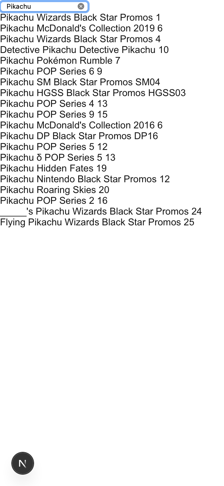
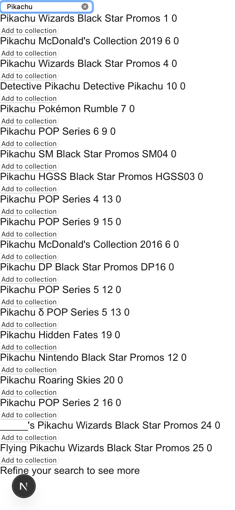
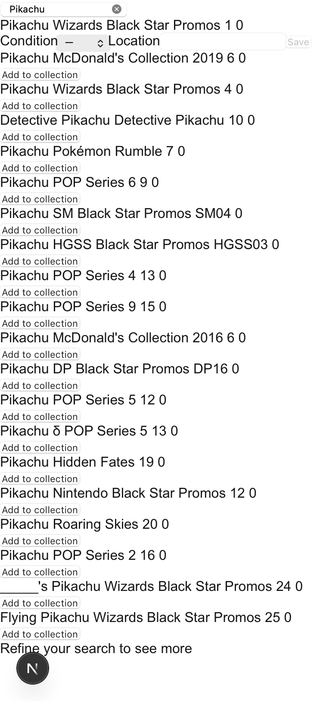
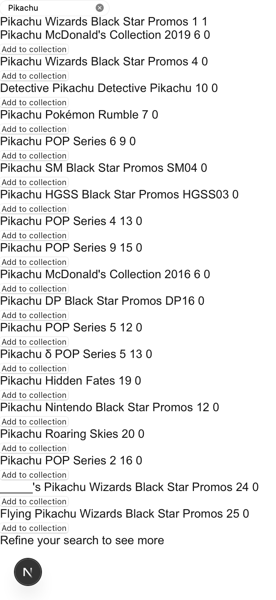

# Card Search

Look up any Pokémon TCG card by name and check your collection status — from the shop floor, in seconds.

## Before you start

Open the app on your phone. Enter your passphrase if prompted.

---

## Search for a card

1. **Open the app.** The search input is the first element on screen — no navigation is needed before you can type.

2. **Type part of the card name.** Search is case-insensitive and matches any card whose name contains your text. "pika" will find "Pikachu"; you do not need to type the full name.

3. **Pause typing.** Results appear automatically once you stop — you do not need to press Enter. Results are visible within 3 seconds of your last keystroke.

   

4. **Read the result.** Each card shows its name, set name, collector number (for example, 025/165), and language (English in v1). If more than 20 cards match, the first 20 are shown with a prompt to refine your query.

**Result:** Matching cards appear in a list below the search input, on a single screen.

### Troubleshooting: nothing appears

- **Empty input or spaces only:** the app shows a prompt to enter a card name. No search runs until you type at least one real character.
- **No cards found:** if the catalogue has no cards matching your text, the app displays a "no cards found" message — not a blank list. Try a shorter or different term.
- **Loading indicator:** while results are being fetched a loading indicator is visible. If results take longer than 300 ms to arrive, the indicator stays until they do.
- **Search error:** if the search fails (for example, no network), the app shows a readable message and a retry button.

---

## Check ownership status

After a search, each result shows how many copies you own and the details of each copy — inline, on the same screen.

1. **Copy count.** The number beside each card is the count of copies you own. A count of 0 means you do not currently own this card.

2. **Copy details.** If you own one or more copies, the condition, storage location, and language of each copy appear directly below the card header — no separate screen needed. Language is always English in v1.

   

3. **More than 5 copies.** If you own more than 5 copies of a card, the first 5 are listed and a control lets you see the rest.

**Result:** Ownership information is visible inline with the search result, without navigating away.

### Troubleshooting: copy count looks wrong

If the app cannot read your collection data, it shows a distinct error message. It does not display "0 copies" or a "not owned" state when data is unavailable — doing so would be misleading.

---

## Add a card to your collection

Use this when a result shows 0 owned copies and you want to record that you have it.

**Before you start:** you will need to know the card's condition (NM, LP, MP, HP, or DMG) and the name of the binder or box where you are storing it.

1. **Find the card** using search (see above).

2. **Tap "Add to collection".** This button appears only on results showing 0 copies.

   

3. **Fill in the details:**
   - **Condition:** select one of NM, LP, MP, HP, or DMG.
   - **Location:** type the name of the binder or box (for example, "Binder 3"). This field cannot be left blank.

   

4. **Tap Save.** A spinner shows that the save is in progress.

**Result:** The copy count for that card updates to 1 in the current results, without a page reload. The "Add to collection" button disappears for that card.

### Troubleshooting: save fails

The app shows an error message inline in the form. The Save button becomes available again so you can retry. Your condition and location input is not discarded.

---

## What this feature does not cover

- Editing or deleting existing copies (separate feature).
- Bulk import from a spreadsheet.
- Collection valuation or price display.
- Barcode or photo scanning.
- Full offline mode — if there is no network connection the app shows a retry option, but results are not cached locally.
